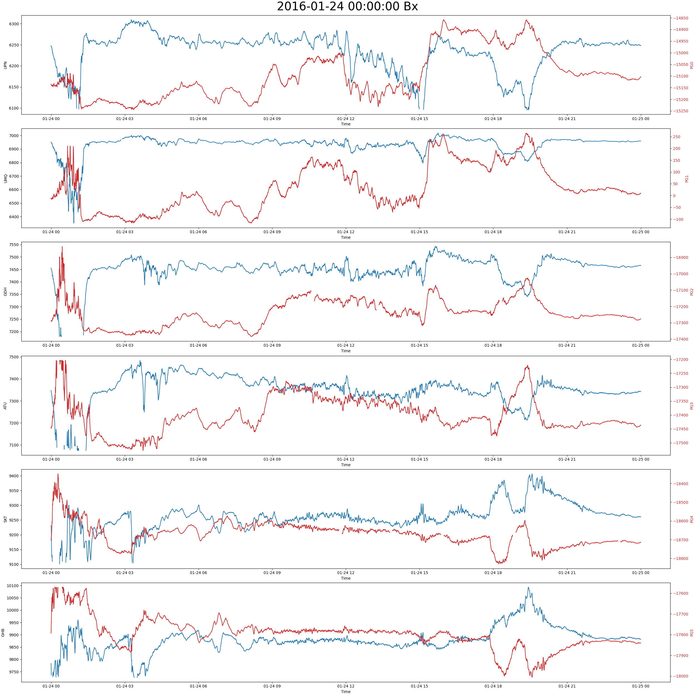
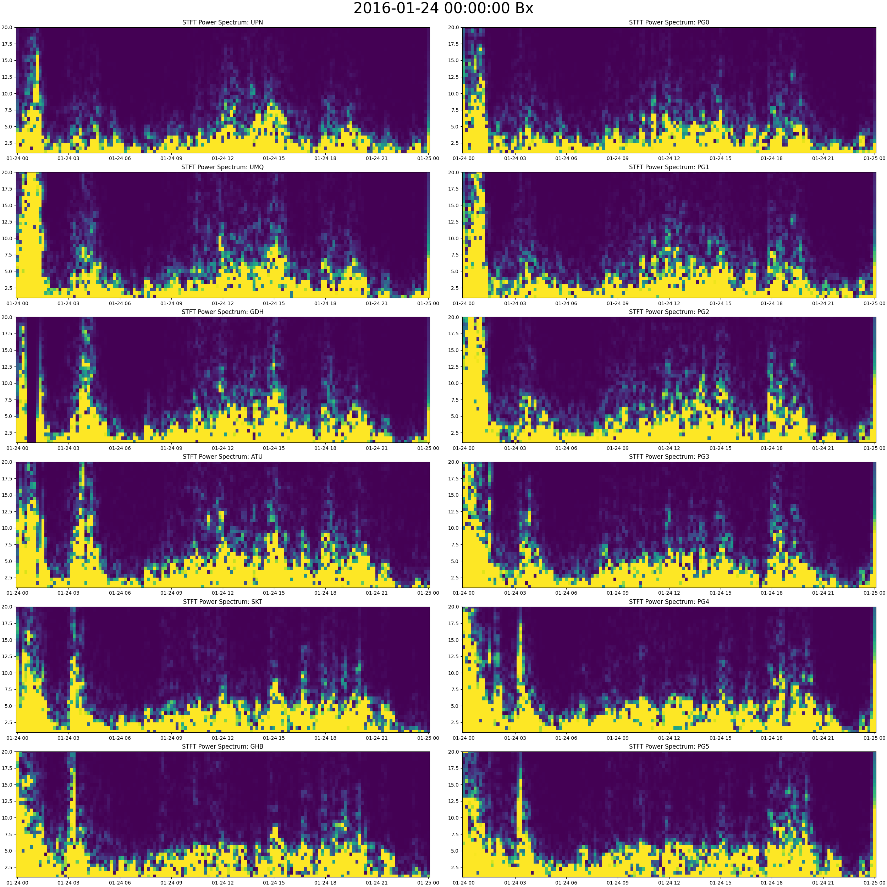
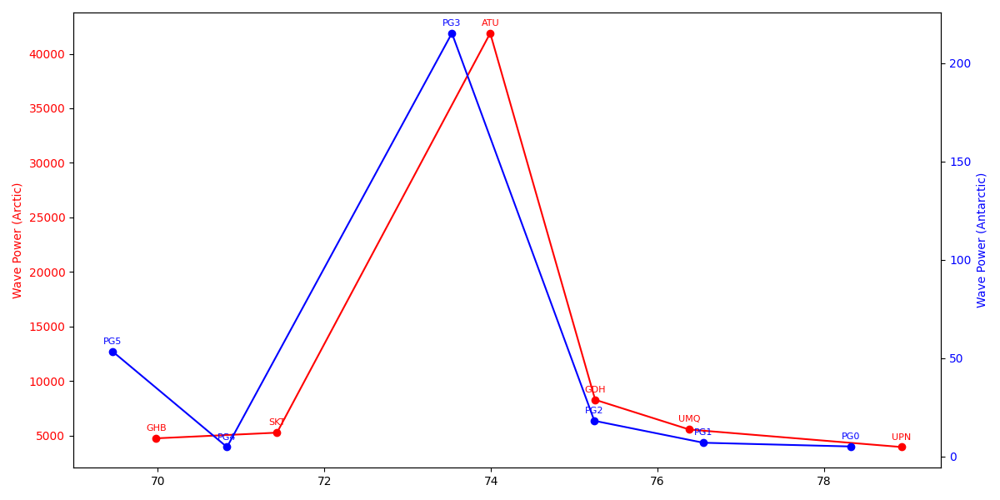

# magplots
A python library to pull data and make plots from ground magnetometers. Emphasis on plots for comparing magnetometers at conjugate points.

<!-- Click here to run example code: [](https://mybinder.org/v2/gh/KCollins/magplots/HEAD?labpath=Examples.ipynb) -->

## Installation
`pip install magplots`
Make sure that you have a folder in your directory named `/output`. This is where plots and dataframes will be saved.

## MWE
You can check all the component functions by running the `magall()` function with default values.
```
from magplots.magFunctions import * # packaged version
# from magFunctions import * # local version
magall(is_verbose = True)
```

# Functions
Type `help('magFunctions')` for function documentation.

To pull data from Tromsø Geophysical Observatory, save a password locally in a file named `tgopw.txt`. (You will have to obtain the password from TGO.) If no such file exists, data is automatically pulled from CDAWeb.

## Example Plots
### Time domain plot: 
This plot is produced with the `magplot()` function:


### Spectrogram: 
This plot is produced with the `magspect()` function:


### Wave Power Plot: 
This plot is produced with the `wavefig()` function, which calls `wavepwr()` to calculate the wave power for each station within a given frequency range. 

